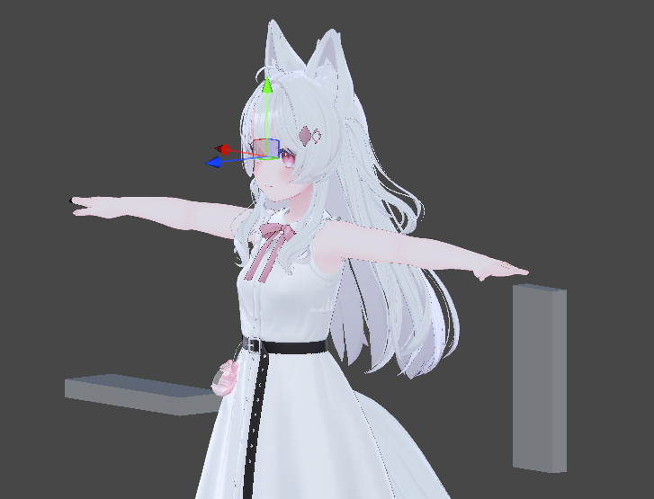
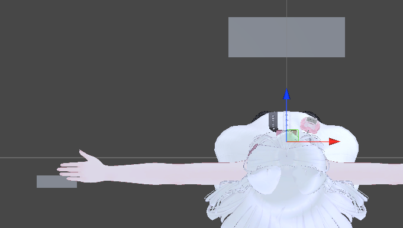
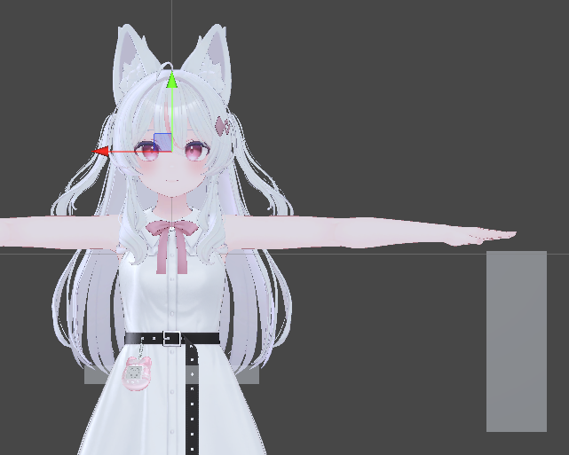

# VRC Passthrough Keyboard (TBC)

A 60% keyboard on a VRChat avatar with chroma key functionality for local passthrough.

## Features

- Spawn a keyboard in the world
- Adjust its location with the left-hand fist gesture
- Adjust its scale with the right-hand grip gesture
- Show a chroma key (green) on the keyboard for passthrough
- Add an overlay that removes map post-processing on the chroma key (workaround)

## Dependency

- Keyboard model: https://phmotionworks.booth.pm/items/5809683

## Installation

|  |  |  |
|--- | --- | --- |

- The following GameObjects need to be adjusted
  - **WorldFixed/SpawnTargetProxy**: Default spawn location relative to the hips
  - **WorldFixed/HoldTargetProxy**: Hold location relative to the left hand
  - **WorldFixed/FilterCamAnchor**: Eye position for the filter view overlay (a workaround for map post-processing)
    1. Uncheck Is **Active** in the Parent Constraint.
    2. Move the **FilterCamAnchor** to the desired position.
    3. Click the **Activate** button in the Parent Constraint.

## How to Use

1. Toggle **On** to spawn the keyboard.
2. (Optional) To use the chroma key functionality:
   1. Toggle on **ChromaKey**.
   2. Toggle on **AlwaysOnTop (Key)** to show the chroma key over your hands.
   3. If the post-processing in the map shifts the key color so that the passthrough stops working, there is a workaround:
      1. Toggle on **ClearPostEffectOverlay** to add an extra rendering overlay without any post-processing.
      2. Adjust **FilterCamIPCCorrection** so it works best for you.
3. Use the **fist gesture** with your **left hand** to hold the keyboard and place it in the desired location.
4. Use the **grip** with your **right hand** on the right edge of the keyboard to scale it to the proper size.
5. Toggle on **LockHold** and **LockScale** to prevent accidental movement or scaling of the keyboard.
